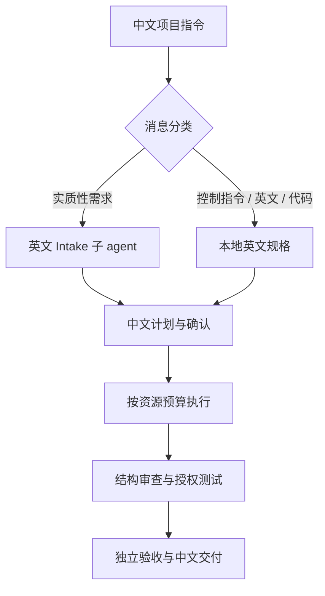

# 中文复杂项目编排器

[English](README.en.md)

面向中文用户的长期复杂项目 Agent Skill：内部使用精简英文组织任务和子 agent，所有面向用户的提问、计划、进度、授权请求和最终交付默认使用中文。

它解决的不是“让 agent 多开几个子 agent”，而是控制复杂项目中最容易浪费资源的环节：需求丢失、过早实施、重复扫描、无边界并行、未经授权的测试，以及缺少独立验收。

## 核心工作流



主要保证：

- 实质性中文或中英混合需求先被编译成紧凑、忠实的英文任务规格。
- 原始用户指令始终是最高权威，译文不得覆盖或弱化原始约束。
- 实施前必须先规划并获得确认；重大范围变化需要重新确认。
- 默认串行、节省 token；仅重型任务或明确追求速度时增加执行子 agent。
- smoke test 必须获得针对具体测试的许可，且未经检查不得编造命令或环境。
- 最终由未参与翻译和实施的全新只读 agent 独立验收。
- 内部可以全程使用英文，所有用户可见内容默认使用中文。

## 适用场景

适合：

- 多阶段、多交付物或预计跨线程的项目；
- 大型代码改造、平台建设、研究项目或长期文档工程；
- 需要显式资源预算、人工批准门禁和独立验收的任务。

不适合：

- 一次性简单问答；
- 用户没有显式启动本 Skill；项目状态文件不能代替显式调用；
- 只需要快速翻译、单文件小改或普通信息检索的任务。

## Intake 策略与执行模式

两个设置彼此独立，避免把翻译策略与执行速度混为一谈：

| 设置 | 可选值 | 行为 |
| --- | --- | --- |
| `intake_policy` | `economy`（默认） | 实质性中文需求使用一次性翻译 agent；简单批准、状态指令、英文或纯代码本地处理 |
| `intake_policy` | `strict` | 每条项目消息都经过全新 intake agent，适合要求严格前置处理的环境 |
| `execution_mode` | `economy`（默认） | 默认串行，优先减少上下文传递、重复扫描和 token 消耗 |
| `execution_mode` | `fast` | 优先缩短墙钟时间；仅在工作流真正独立时增加有边界的并行 agent |

## 安装

### Codex CLI / Codex 桌面端

将整个仓库克隆或复制到 Codex skills 目录，并保持目录名不变：

```text
~/.codex/skills/zh-complex-project-orchestrator/
```

Windows 通常对应：

```text
%USERPROFILE%\.codex\skills\zh-complex-project-orchestrator\
```

`~/.codex` 只是默认值；如果设置了 `CODEX_HOME`，请使用 `$CODEX_HOME/skills/zh-complex-project-orchestrator/`。完成后重启 Codex 或开始一个新线程。不同 Agent Skills 客户端的目录位置可能不同，请以对应客户端文档为准。

仓库根目录本身就是 Skill 根目录；不要只复制 `SKILL.md`，否则会丢失工作流、第三方能力规则和行为测试。

## 使用

显式启动：

```text
使用 $zh-complex-project-orchestrator 管理这个项目。内部使用英文，所有面向我的输出使用中文。
```

切换为严格 intake：

```text
这个项目使用 intake_policy: strict，每条项目消息都先经过 intake agent。
```

优先速度：

```text
将 execution_mode 切换为 fast；只有独立工作流才并行。
```

启动后，Skill 会先给出中文计划、验收标准和资源预算，并等待确认。计划批准不自动授权发布、部署、生产写入、付费调用或第三方安装。

## 项目状态

代码项目优先使用：

```text
.codex/zh-complex-project-state.md
```

非代码项目可使用已获批准的持久文件位置；没有持久后端时，Skill 会提供中文 checkpoint，并明确说明无法保证跨线程恢复。状态文件不得包含密钥、凭据或不必要的个人数据。

## 可选第三方能力

本仓库不捆绑或自动安装第三方 Skill。仅在明确匹配且收益超过加载成本时考虑：

- [Matt Pocock Skills](https://github.com/mattpocock/skills)：需求压力测试与澄清；
- [Ponytail](https://github.com/DietrichGebert/ponytail)：减少编程任务中的过度实现；
- [Nature Skills](https://github.com/Yuan1z0825/nature-skills)：科研写作、科研绘图及相关工作流。

安装任何第三方能力前，必须获得当前用户的明确授权，并检查来源、脚本、hooks、权限和持久影响。

## 仓库结构

```text
.
├── SKILL.md                    # Agent Skill 入口
├── agents/openai.yaml          # Codex UI 元数据
├── references/                 # 按需加载的工作流与测试说明
├── scripts/validate_repo.py    # 零依赖仓库校验
├── docs/architecture.md        # 设计、边界与降级策略
├── .github/                    # CI、Issue 和 PR 模板
├── CHANGELOG.md
├── CONTRIBUTING.md
├── SECURITY.md
└── LICENSE.md
```

## 验证

本地运行：

```bash
python3 scripts/validate_repo.py
```

维护者还可以使用 Agent Skills 官方规范推荐的 `skills-ref`：

```bash
skills-ref validate .
```

GitHub Actions 会在 push 和 pull request 时运行仓库内的零依赖校验器。

## 已知边界

- Skill 无法让协调 agent 在收到消息前完全看不到原始 prompt；它只能要求协调 agent 在开始求解前先完成 intake。
- 新线程不会继承激活状态；用户必须重新调用 Skill，之后才可用明确、未过期的项目状态记录恢复进度。
- 缺少 Plan 或子 agent 能力时会明确降级，不能把本地自检描述为独立验收。
- 本 Skill 管理工作流，不会绕过宿主平台的权限、审批或安全策略。

更多设计说明见 [docs/architecture.md](docs/architecture.md)。参与贡献前请阅读 [CONTRIBUTING.md](CONTRIBUTING.md) 和 [SECURITY.md](SECURITY.md)。

准备创建 GitHub 仓库、配置保护规则或制作 Release 时，请按 [GitHub 发布指南](docs/publishing.md) 操作。建议仓库名保持为 `zh-complex-project-orchestrator`，使仓库根目录名与 Skill 名一致。

## 许可证

本项目采用 [MIT License](LICENSE.md)。你可以使用、复制、修改、合并、发布和分发本项目，但须保留许可证中要求的版权与许可声明。
